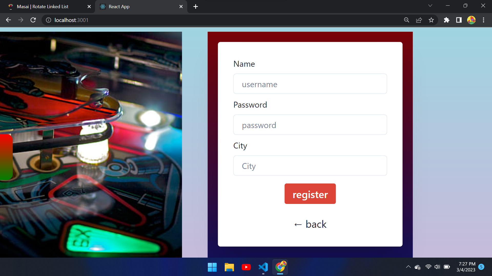
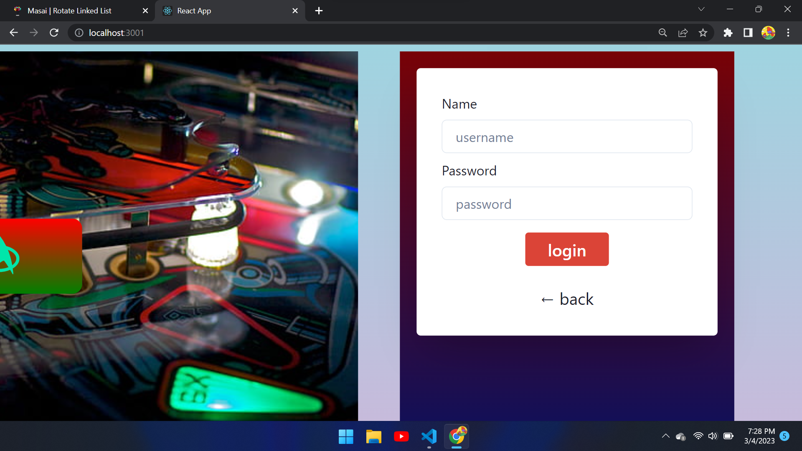
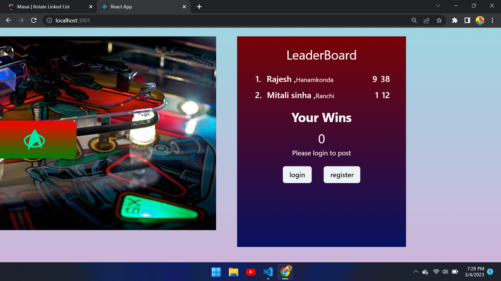
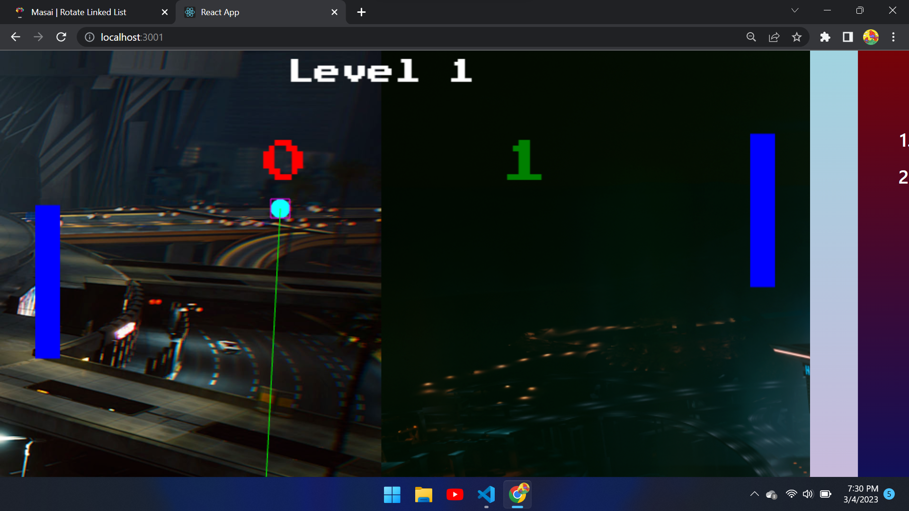
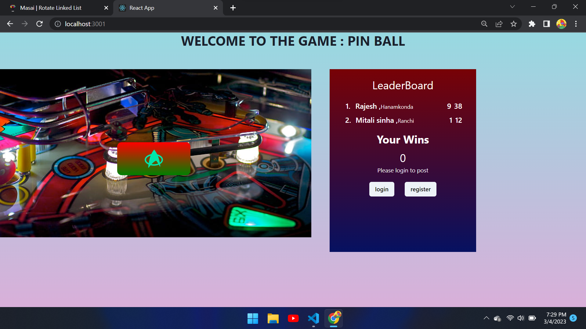

# <h1 align="center">Pin-ball</h1>
 
 play live :- https://ballpaddlegame.netlify.app/

## Tech-Stack :-
   1. React
   2. TypeScript
   3. JavaScript
   4. HTML
   5. css
   6. Phaser
   7. Chakra-UI
   8. Chakra-react
   9. mongoDB
   10. express

## Libraries Used :-  
 ### Frontend Libraries
  #### 1. React-icons 
           React-icons is a small library that helps to add icons to React apps. It delivers the 
          icons to app as a component, So they're easier to work with, and it lets
          us style them so they're consistent with the overall style of the app.
  #### 2. Phaser 
            Phaser is a fun, free and fast 2D game framework for making HTML5 games
            for desktop and mobile web browsers.   
 ### Backend Libraries
  #### 1. express
            js, or simply Express, is a back-end web application framework for building RESTful 
            APIs with Node. 
  #### 2. Mongoose
            Mongoose allows users to conveniently create and manage data in MongoDB. While 
            it is possible to manage data, define schemas, etc.  
            
## Available functions :-
  1. Sign-up
      
  2. login
      
  3. score-dashboard
      
  4. game viewport
      
  5. game page    
      

## Rule of the Game :-
  1. Register first, for, without registering you would not be able to see your score to leaderboard.
  2. Stop the ball from colliding the ball with boundry wall.
  3. If you are not able to do this for three times you will lose.
  4. If the system at the right side lose three times before you, you win.
  5. After every win, the level will be increased and the speed of the pin-ball will increase.
 
## Project Members :-
  1. Faizal Siddiqui
  2. Mitali Sinha
  3. Rajesh Ranjan Sharma
  4. Rajesh Pachika
